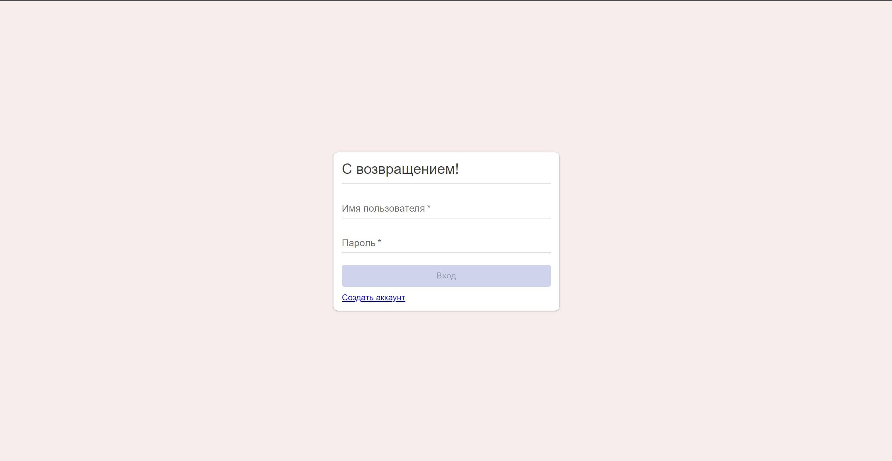
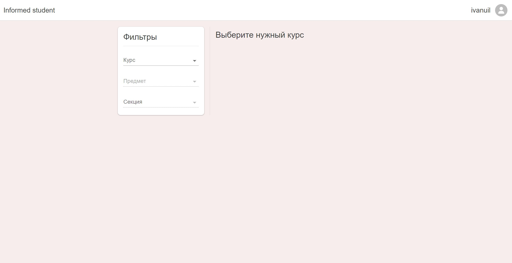
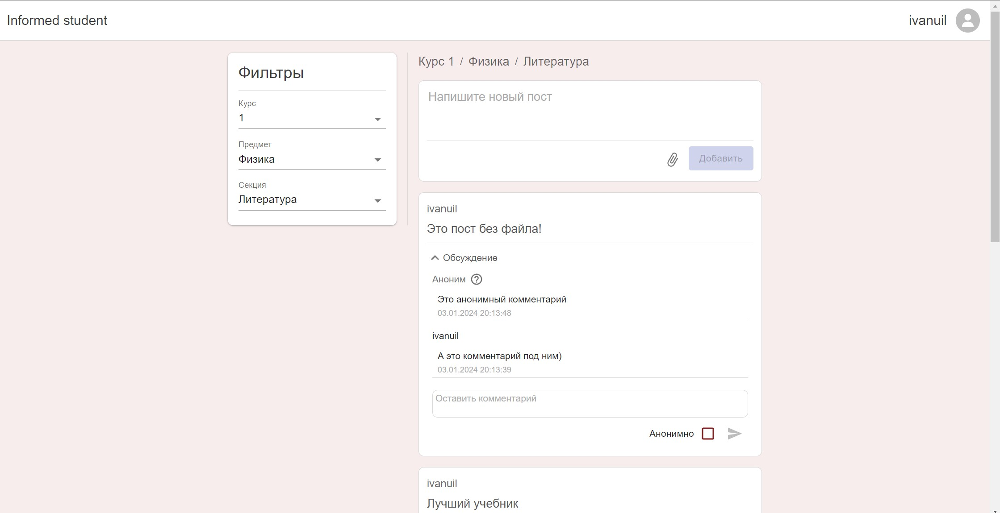
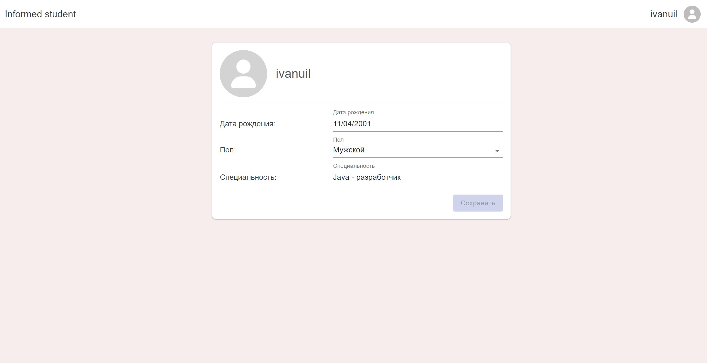
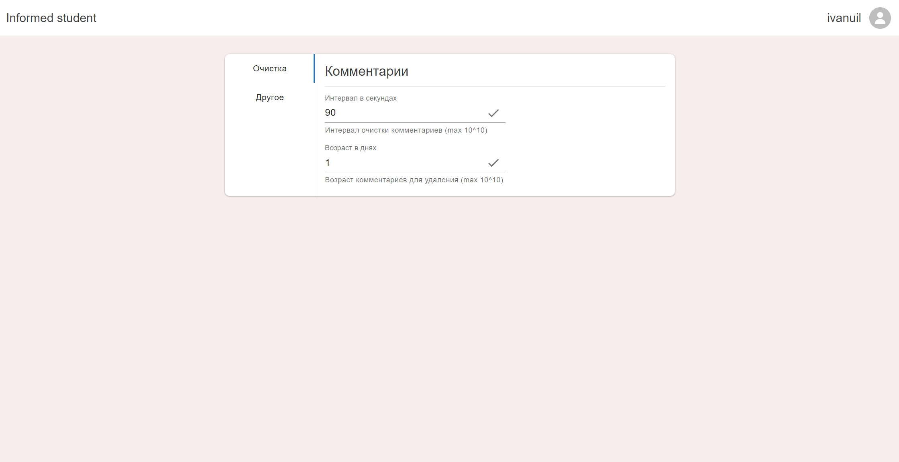
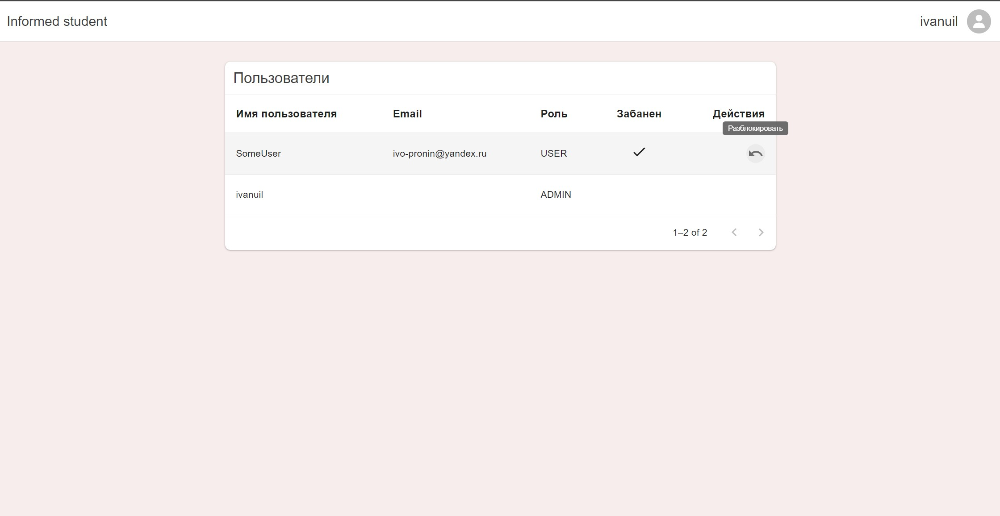

## informed-student-back-end

### About

Проект реализован в рамках академии бэкенда Tinkoff. Представляет собой сервис для студентов позволяющий делится 
учебными материалами, обсуждать их, а также узнавать новости учебного заведения.

Фронтенд: [GitHub](https://github.com/Ivanuil/informed-student-frontend)

### Stack

* Spring Boot
* PostgreSQL
* Minio
* Spring Security
* Quartz


* JUnit
* TestContainers

### Screenshots

Стартовая страница сервиса, авторизация реализована с помощью:
<br>
Авторизация реализована с помощью Spring Security. Существует 3 роли пользователей: Administrator, Moderator, User;
подробнее о ролях в разделе [Roles](#Roles)

<br>
Посты принадлежат одной из категорий и предмету. Предметы относятся к одному из курсов (1-6).

<br>
Есть возможность оставлять анонимные комментарии, удалять комментарии и посты может автор или администратор.

<br>
У каждого пользователя есть небольшая публичная страница с личной информацией.

<br>
У администратора есть панель управления регулярно выполняемыми задачами через соответсвующую панель.
Для регулярных задач использован Quartz.

<br>
Администратор может просмотреть список всех пользователей сервиса и забанить любого пользователя.
Забаненный пользователь не может зайти на сервис или зарегистрироваться под теми же реквизитами.

### How to run

### Fast Run

1. Необходимо запустить .bat файл в папке docker (для Windows), что локально поднимет MinIO и Postgres.
2. Установить "dev" профиль Spring в среде разработки (по умолчанию логин и пароль админа: admin). 

#### Server

Для запуска сервера необходимо указать реквизиты для доступа к Postgres и MinIO, настройки SpringSecurity:
```
spring.datasource.username={Postgres username}
spring.datasource.password={Postgres password}

minio.datasource.username={MinIO username}
minio.datasource.password={MinIO password}

app.security.jwt.secret-key={Security key}
app.security.jwt.expiration-time={Key expiration time}

admin.username={Admin username}
admin.password={Admin password}
```
Security key можно сгенерировать на сайте: [seanwasere.com/generate-random-hex/](https://seanwasere.com/generate-random-hex/).
Key expiration time - в миллисекундах, можно использовать значение 3600000 (6 часов).
Admin username/password - логин и пароль администратора.

#### Запуск MinIO в Docker

Команда локально запустит контейнер MinIO из репозитория Docker:
```
docker run -p 9000:9000 -p 9001:9001 quay.io/minio/minio server /data --console-address ":9001"
```
Реквизиты по умолчанию:
```
minioadmin:minioadmin
```

#### Запуск Postgres в Docker

Команда запустит Postgres в контейнере
```
docker run --name {Container name} -e POSTGRES_USER={Postgres username} -e POSTGRES_PASSWORD={Postgres password} -e POSTGRES_DB=postgres -d postgres
```

#### Tests

Тестирование происходит с использованием тестовых контейнеров, требуется только запущенный Docker

### Documentation

Документация API доступна в [Swagger](http://localhost:8080/swagger-ui/index.html). Для получения доступа ко всем 
end-point необходима авторизация через администратора.

### Roles

Существует три роли пользователя: ADMINISTRATOR, MODERATOR, USER. Их права:

|                        | ADMINISTRATOR | MODERATOR | USER |
|------------------------|---------------|-----------|------|
| СОЗДАНИЕ ПОСТОВ        | ✔️            | ✔️        | ✔️   |
| СОЗДАНИЕ КОМЕНТАРИЕВ   | ✔️            | ✔️        | ✔️   |
| СОЗДАНИЕ ПРЕДМЕТОВ     | ✔️            | ✔️        |      |
| СОЗДАНИЕ ПАПОК         | ✔️            | ✔️        |      |
| ВЫДАЧА ПРАВ МОДЕРАТОРА | ✔️            |           |      |

Любой зарегистрировавшийся пользователь получает роль USER.
ADMINISTRATOR может создавать аккаунты MODERATOR'ов.
ADMINISTRATOR существует только один, его реквизиты указываются при запуске.
